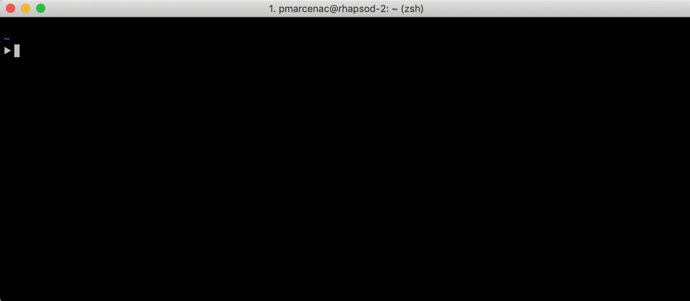

# kubeasy

[](https://travis-ci.org/marcenacp/kubeasy)

`kubeasy` is an interactive wrapper around `kubectl` to help you manage your Kubernetes clusters.



## Installation

- Install `kubeasy` by downloading the latest version from Github
```bash
git clone https://github.com/marcenacp/kubeasy.git
cd easy-docker/
npm install
npm link
```

- Use it with the command: `kubeasy`

## Development

### Development pattern

I use [blessed](https://github.com/chjj/blessed) to render the command-line interface,
and Node's [EventEmitter](https://nodejs.org/api/events.html) to propagate data between hooks and widgets.

- **Hooks** (in `src/hooks`) get data from Kubernetes using `kubectl` and store it in the state.

- **Widgets** (in `src/widgets`) watch inputs from user and render the command-line interface according to the state.

### Useful commands

- `npm run dev`: launch application with [nodemon](https://github.com/remy/nodemon)
- `npm run test`: check syntax in Javascript files using [prettier](https://github.com/prettier/prettier) (run in CI)
